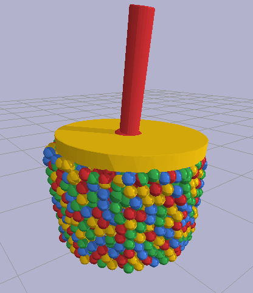

# The regolith project
Exploring Bullet Physics as a tool to simulate behavior of regolith and granular soils.  


## Note about requirements and build steps
Complete set-up and build instructions for Ubuntu 20.04 are provided in [the Dockerfile](Dockerfile).
Dockerfile should be treated as reference for setting up and building the project on your machine.
You can verify the correctness of the steps in Dockerfile by:
```
docker build -t regolith .
docker run regolith
```
Note, that these commands will take long time and won't install anything on your local machine.  
They will only allow you to run one example from _simulations_ directory without gui.  
They will not provide an easy way to modify and rebuild code or modify the configuration.  
Execute the commands used inside Dockerfile on your local machine to have fully prepared environment.

## Requirements
Bullet Physics installed from source (preferably in /usr/local)  
Note: bullet installed via `apt install libbullet-dev` **will not work**  
because CommonInterfaces (used for examples) are not included in the package  

## Build instructions
```
mkdir build
cd build
cmake ..
make
```

## Run simulations
For ConePenetrationTest, link example config to current directory:
```
ln -s simulations/ConePenetrationTest/config.example.yaml build/config.yaml
```
Executables for simulations will be in `build/simulations` subdirectories
